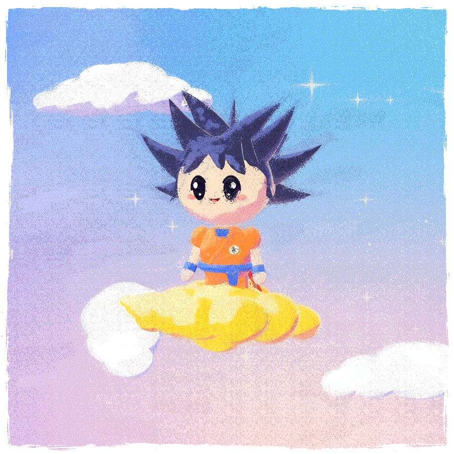
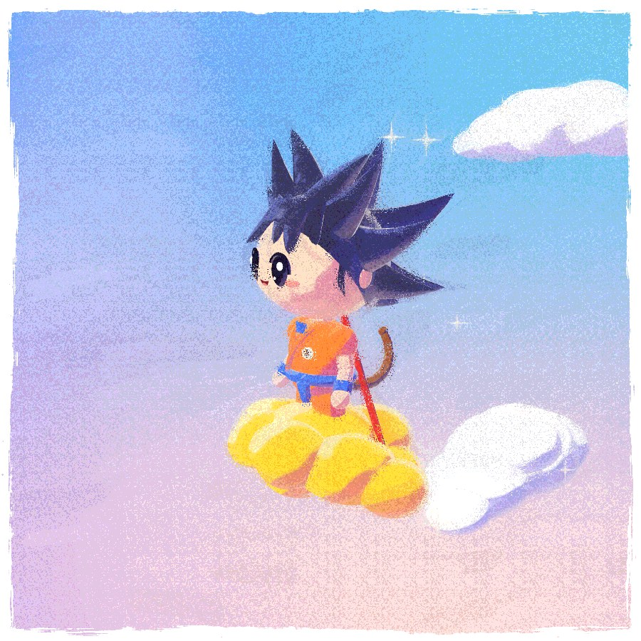
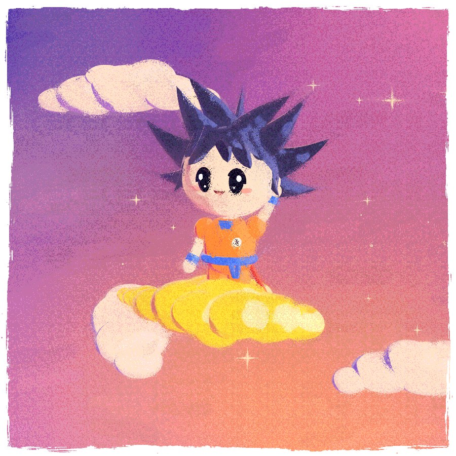

# Chibi Jelly Painting

A chibi martial-arts kid riding a wobbly cloud, painted live in the browser.

<p>
  
  
  
</p>

- **Live:** [chibi-jelly-painting.vercel.app](https://chibi-jelly-painting.vercel.app)
- **Model:** Opus 5.5 (high)
- **Built with:** Droid in the Factory app
- **Stack:** three.js WebGPU + TSL (WebGL 2 fallback), Vite
- **Style:** a screen-space paint filter after mesq's [Jelly Painting](https://x.com/mesqme/status/2106646827193778352)
- **Character:** built from primitives in code, with no model files

## Run it

```bash
npm install
npm run dev      # http://localhost:5173  (add ?webgl to force the WebGL 2 backend)
npm run build    # static build in dist/
```

## Controls

Tap the kid to jump, tap the cloud to bounce it, drag to orbit, scroll to zoom.
The two painted cards beside the sheet switch between day and dusk; they are
captured from the live pipeline at load.
Keys: `space`/`j` jump · `w` wave · `t` day/dusk · `g` paint settings.

## How it works

- `src/materials/painted.js` — painted lighting. Object-space brush noise bends the
  shading normal (a procedural stand-in for hand-painted normal maps), then hard,
  noise-wobbled light bands break surfaces into flat painted planes with cool
  shadows, a rim light, a warm bounce from the cloud and a pastel haze that
  keeps the darks soft.
- `src/post/paintFilter.js` — the screen-space painting, all TSL:
  1. paper + torn frame (static): a square sheet with a torn, deckled edge,
     dry-brush bristles and loose paint flecks on the paper around it
  2. stroke grid (static): jittered dabs, each with a random ticket
  3. structure tensor of the colors (Sobel), blurred twice (detail + wide halo)
  4. flow: a stroke direction running along color edges, double-angle encoded
  5. strokes: march 10 steps each way along the flow, smear the color and let the
     strongest dab on the path claim the pixel with its flat center color
  6. composite: agreement-gated smear, speckle (cells that borrow color from a
     few pixels across the stroke, heaviest on edges) and a screen-locked
     9-level dither that gives the multi-hue pastel grain. Impasto relief,
     paper grain and edge pooling are available in the settings but off by default
- `src/scene/character.js` — the kid, built from primitives (no model files).
- `src/scene/world.js` — the nimbus cloud, far clouds, the painted multi-hue sky
  and the twinkling sparkles.
- `src/scene/rig.js` — springs for bobbing, blinking, head tracking, squash-and-stretch
  jumps, hair lag, tail swish and the occasional wave.
- `src/themes.js` — day/dusk palettes, eased every frame.

Dev-only debug hook: `window.__chibi` (renderer, scene, camera, filter, rig, kid).
